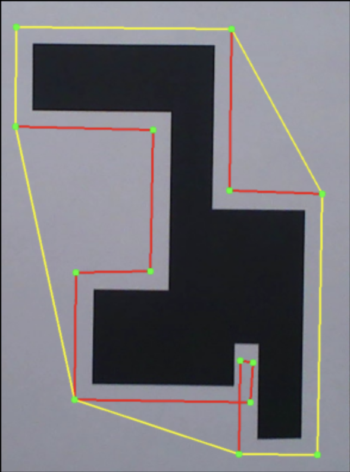
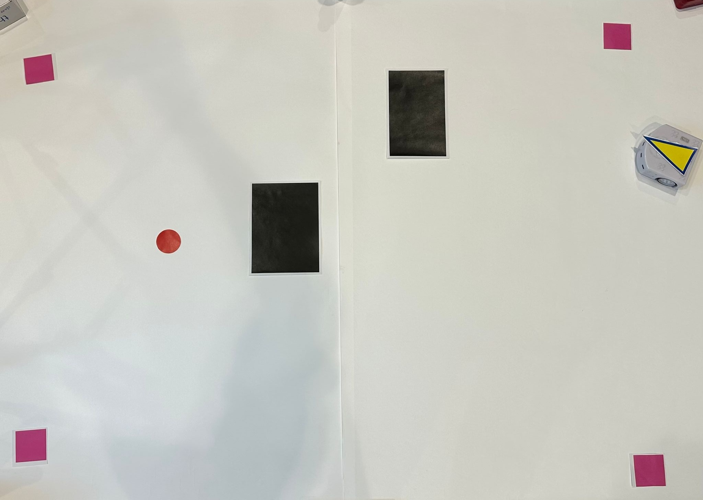
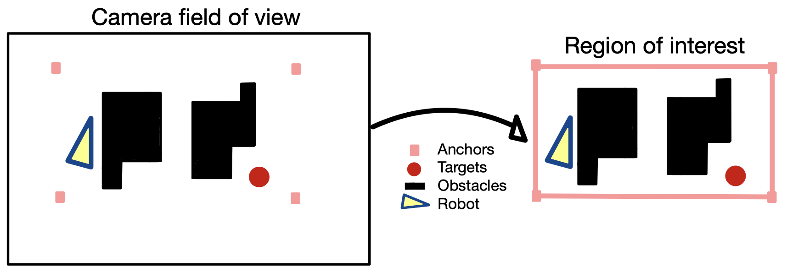
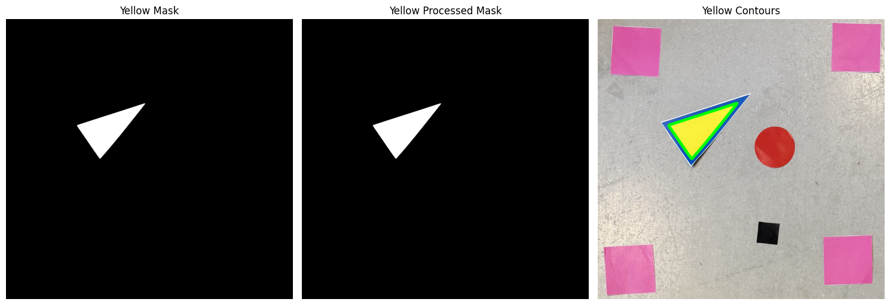

As part of the Basics of Mobile Robotics course at EPFL, our team designed and implemented an autonomous navigation system for the Thymio robot, integrating computer vision, motion control, and mapping techniques. 
The robot was tasked with exploring an unknown environment, identifying red-colored targets, retrieving objects, and returning to its initial position while avoiding static and dynamic obstacles. The robot was designed to maintain autonomous navigation even when its main camera temporarily loses visibility, relying on odometry and Kalman filter sensor fusion to estimate its position until visual data becomes available again. It was also made robust to a “kidnapping” scenario, where it could be suddenly displaced and still recover its localization and continue operating autonomously.

I was primarily responsible for developing the computer vision pipeline, which allowed the robot to perceive and interpret its surroundings in real time through an external camera.
Using OpenCV, I implemented a color-based detection system to locate red targets and distinguish obstacles and free space from the camera feed. 
The system also included shape and contour processing to robustly extract environmental features and feed them into the robot’s mapping and navigation modules.

  
  Convex hull detection and contour extraction of obstacles using OpenCV.

The environment was defined by black obstacles, red circular targets, and pink square calibration markers placed at known coordinates for camera calibration. 
These markers provided a reliable reference frame, enabling perspective correction and accurate localization of the robot and targets.

  
  The robot's environment, with calibration markers, targets, and obstacles.

After the calibration step, the system automatically defined a region of interest corresponding to the robot’s workspace within the camera field of view. 
Objects such as obstacles, targets, and the robot were then segmented, detected, and tracked within this region. 
This process ensured that the navigation system could focus on relevant parts of the scene and ignore background elements.

  
  Camera calibration and extraction of the region of interest.

To identify and track the robot’s position and orientation, a color-segmentation-based marker detection was implemented. 
The robot was equipped with a distinctive yellow and blue triangular pattern, which could be robustly detected under variable lighting conditions. 
The following image shows an example of the mask extraction and contour detection used to locate the robot’s heading.

  
  Color mask and contour extraction used for robot orientation detection.

The visual data extracted by the perception pipeline was integrated into the robot’s mapping and motion planning modules. 
It continuously updated an internal occupancy map, while a Kalman filter ensured accurate state estimation by fusing odometry and vision-based localization. 
This combination enabled smooth, autonomous navigation even under noisy visual conditions.

Overall, the project combined elements of perception, decision-making, and control to achieve full autonomy. 
The final system demonstrated reliable mapping, accurate target recognition, and smooth trajectory following in real-world conditions.

  <iframe 
    src="https://drive.google.com/file/d/1wTRObgNCnMcC-vWDzunhK5DmzSavFFN7/preview"
    title="Final project demonstration"
    allowfullscreen>
  </iframe>
  Visualization of the robot's movement across the map. Left side is the annotated camera's view, right side is the robot's real life evolution.

