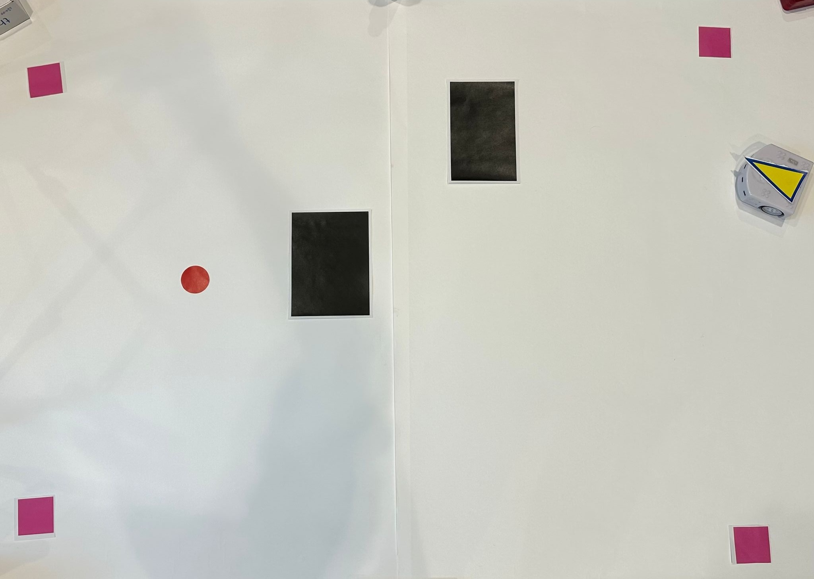

For the Basics of Mobile Robotics course at EPFL, our team built an autonomous navigation stack for the Thymio robot able to explore an unknown environment, retrieve red targets, avoid static and dynamic obstacles, and return home, even when the overhead camera loses visibility or the robot is kidnapped. I was responsible for the computer-vision pipeline: color-based target and obstacle segmentation with OpenCV, perspective correction using pink calibration markers, and robust heading detection through a yellow/blue triangular pattern. Visual features are fused with odometry in a Kalman filter that continuously updates the occupancy map and drives smooth autonomous navigation.

<figure>
  
  <figcaption>The robot's environment, with calibration markers, targets, and obstacles.</figcaption>
</figure>

<figure>
  

    <iframe src="https://drive.google.com/file/d/1wTRObgNCnMcC-vWDzunhK5DmzSavFFN7/preview" title="Final project demonstration" allowfullscreen></iframe>
  

  <figcaption>Left: annotated camera view. Right: the robot moving through the real environment.</figcaption>
</figure>
