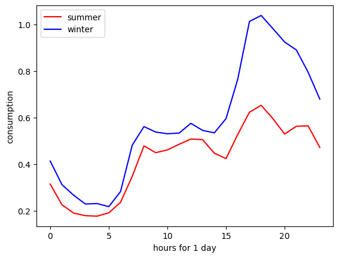
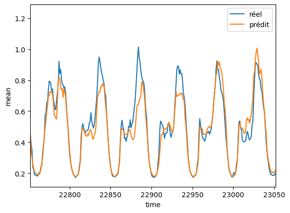

This project focused on analyzing and predicting household electricity consumption in Ireland using data science methods. 
The dataset covered 620 households over an 18-month period, complemented with daily weather observations. 
The objective was to forecast future consumption from past data, identify the most relevant variables, and compare different regression and machine learning models.

After an initial data exploration, the preprocessing step included merging complementary datasets, normalizing values with a Min-Max scaling approach, and encoding the days of the week as binary features. 
Low-variance and highly correlated variables were removed to improve generalization. 
A time-lag structure was added to include the influence of past consumption on future demand.

  

Different models were tested, starting from simple linear and polynomial regressions to more advanced techniques such as random forest and gradient boosting. 
Model performance was evaluated on both test and validation sets after tuning hyperparameters. 
The random forest and gradient boosting models achieved the best accuracy, capturing the periodic consumption peaks related to daily and seasonal habits.

  

The final predictions showed coherent behavior consistent with expected energy usage in December, validating the efficiency of ensemble learning methods for time-series forecasting. 
Beyond model comparison, this study highlighted the influence of external variables such as temperature, time of day, and seasonality on residential energy demand.

