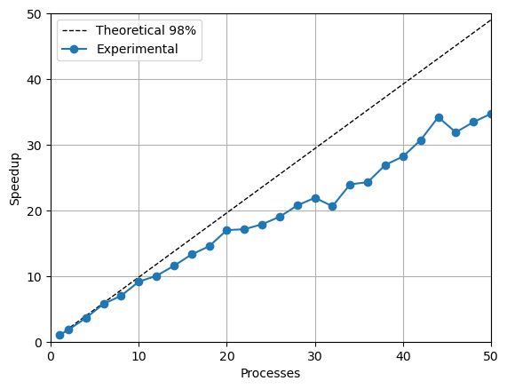
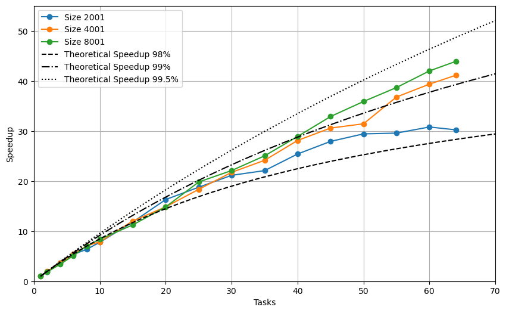
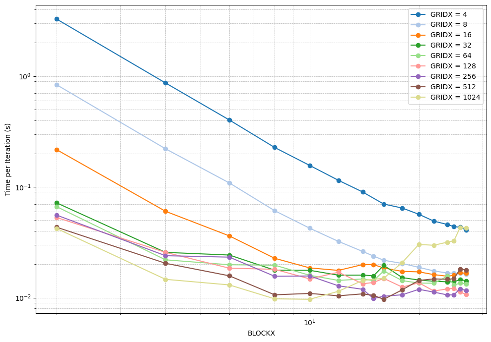

As part of the Parallel and High Performance Computing course, I implemented and analyzed parallel versions of a tsunami simulation based on the shallow water equations. Starting from a sequential C++ solver, I developed both MPI and CUDA implementations to accelerate the numerical computations. 

The MPI version parallelized the time-step and solver routines, efficiently handling domain decomposition and ghost-row exchanges, achieving strong and weak scaling behaviors consistent with Amdahl’s and Gustafson’s laws. 

  

  

The CUDA version introduced several optimized kernels for the solver, exploring the trade-off between workload distribution and hardware utilization through block- and grid-size tuning. 

  

Overall, the parallelization led to significant speedups and scalability improvements, validating the efficiency of both CPU and GPU approaches.

  <iframe 
    src="https://drive.google.com/file/d/17eRBybbB49KU8dngPshqUOB_8kObn6yC/preview"
    title="Final project"
    allowfullscreen>
  </iframe>

