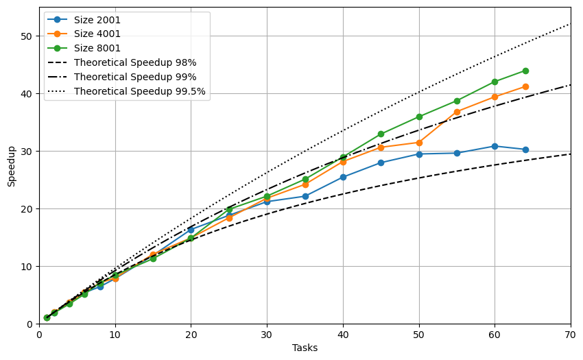

For the Parallel and High Performance Computing course, I parallelized a C++ tsunami simulation based on the shallow-water equations with both MPI and CUDA. The MPI version uses domain decomposition with ghost-row exchanges and reproduces the scaling behavior predicted by Amdahl's and Gustafson's laws. The CUDA version explores block- and grid-size tuning to balance workload distribution and hardware utilization. Both implementations deliver significant speedups, validating the efficiency of CPU- and GPU-based approaches.

<figure>
  
  <figcaption>Strong scaling: experimental vs. theoretical speedup.</figcaption>
</figure>

<figure>
  

    <iframe src="https://drive.google.com/file/d/17eRBybbB49KU8dngPshqUOB_8kObn6yC/preview" title="Final project" allowfullscreen></iframe>
  

  <figcaption>Visualization of the water movement throughout the simulation.</figcaption>
</figure>
