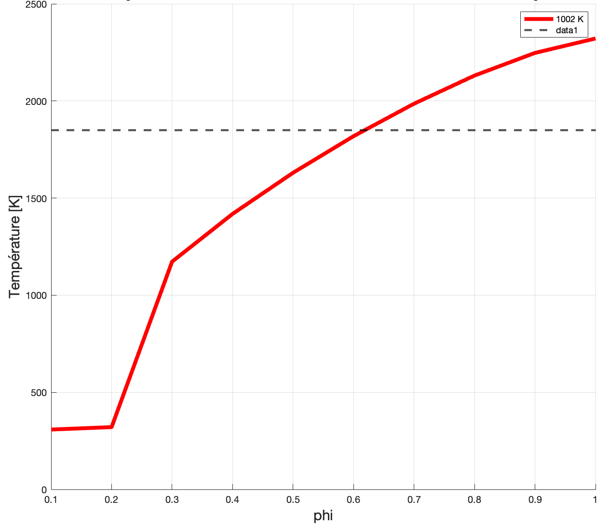
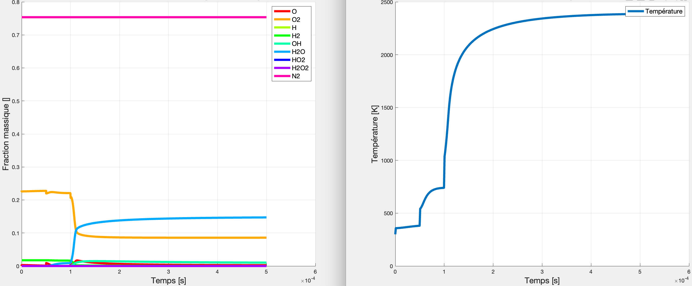
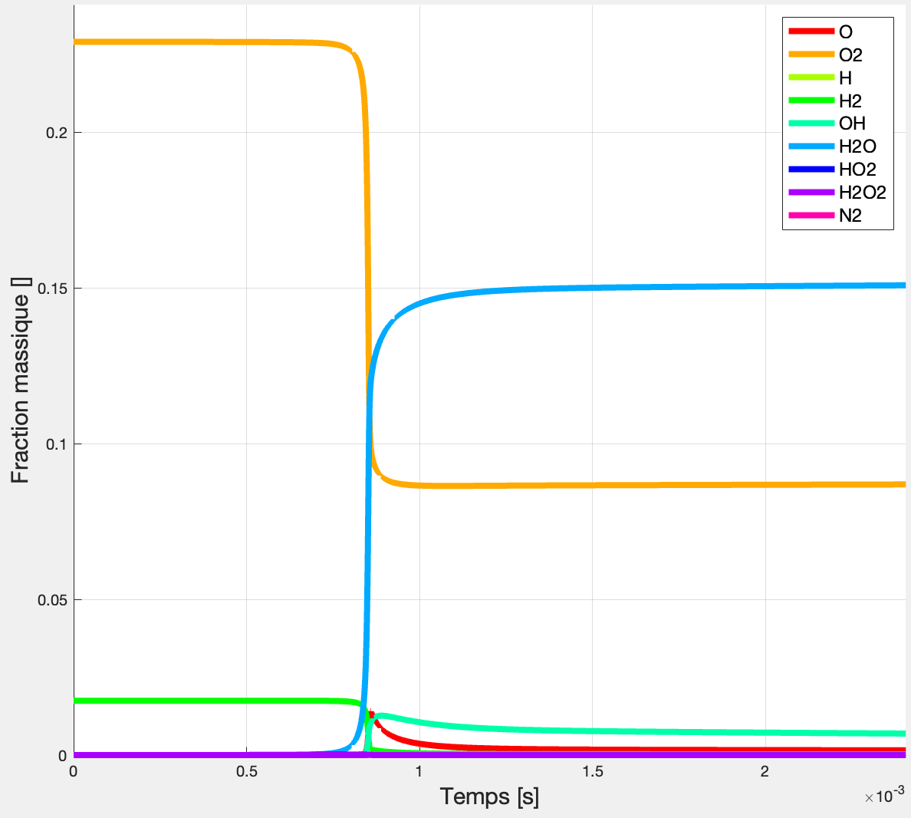

This project was carried out as part of the Reactive Media course at EPFL and focused on modeling plasma-assisted ignition in a hydrogen-air gas turbine. 
The objective was to study the influence of plasma discharges on ignition delay, gas temperature, and combustion stability. 
The work combined thermochemical modeling and simulation in a Perfectly Stirred Reactor (PSR) configuration using Cantera.

In the first part, the combustion chamber was modeled without plasma assistance to determine the ignition temperature and the optimal equivalence ratio. 
The ignition temperature, or Tspark, was found iteratively, and the operating conditions were optimized to limit the maximum flame temperature to 1850 K in order to minimize NOx formation.

  

Once the base combustion model was validated, the study was extended to include nanosecond repetitively pulsed (NRP) discharges. 
This plasma model was implemented by superimposing periodic energy pulses to preheat the gas and accelerate reaction kinetics. 
Different numbers of pulses and gas velocities were tested to determine the conditions required to achieve ignition.

  

The results showed that three nanosecond pulses were sufficient to trigger successful ignition at stoichiometric conditions, while lower pulse counts led to incomplete combustion. 
Subsequent analyses focused on the evolution of gas temperature over time for various inlet velocities.

  

For each configuration, the species mass fractions and temperature profiles were analyzed to characterize reaction dynamics and stability. 
The plasma-assisted case achieved full ignition at gas velocities up to 4.3 m/s, while the non-assisted case was limited to 0.065 m/s, confirming a sixtyfold improvement in the combustion speed.

  

This study demonstrated the potential of plasma-assisted combustion for lean hydrogen-air mixtures, enabling faster ignition and higher operational stability while maintaining lower flame temperatures. 
The results highlight the advantages of coupling advanced plasma physics with combustion modeling for next-generation gas turbine designs.

