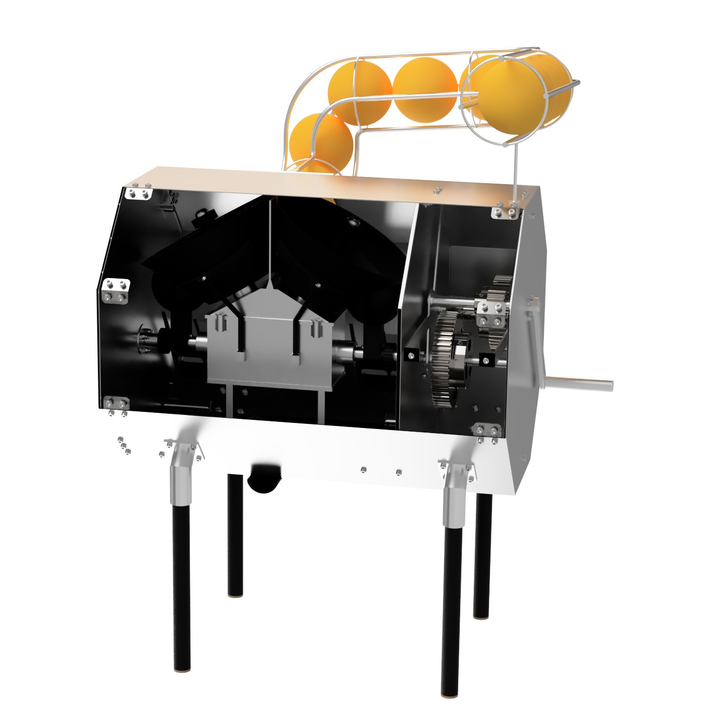

This project was carried out as part of the Mechanical Design and Construction course at EPFL, focusing on the mechanical design and modeling of an orange juice press mechanism. 
The goal was to create a functional, manufacturable, and easy-to-assemble system capable of extracting juice from multiple oranges in a single motion while ensuring user safety and mechanical efficiency.

  
  Complete CAD model of the mechanical juicer.

The system was designed and modeled collaboratively using Catia.
It features a manual crank connected to a series of gears that drive synchronized pressing plates, enabling a consistent and stable extraction motion. 
The design also includes a feeding rail system that automatically delivers the oranges to the pressing area, improving throughput and ergonomics compared to standard single-press systems.

  
  Detailed view of the pressing mechanism.

Material selection and component dimensioning were optimized for weight reduction while maintaining sufficient stiffness and durability. 
The final design met all project constraints, achieving a compact and efficient structure suitable for manufacturing.

