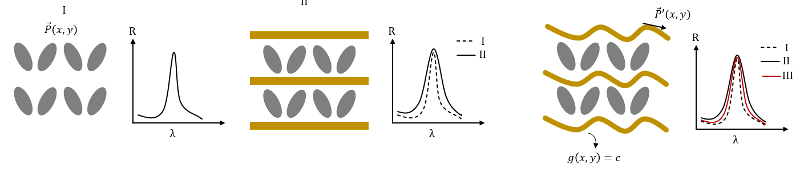

This project focuses on optimizing the geometry of electrodes in photonic and electromagnetic resonator structures in order to maximize the quality factor (Q) of the resonator. The idea is to analyze the field distributions obtained from CST simulations — such as the Poynting vector and the electric field — and determine the surfaces that are tangential to these fields, causing minimal field disturbance. Aligning the electrodes with these tangential surfaces helps reduce energy loss and improve resonance performance.

The methodology involves simulating a baseline resonator structure in CST to extract field profiles at resonance, identifying the potential surfaces that follow the natural flow of the fields, and then adapting the electrode geometry to match these surfaces. The optimization is validated by comparing the Q-factor of the system before and after modification.

  

This study combines electromagnetic theory and numerical optimization to achieve field-conformal electrode designs, inspired by the concept of power-flow-conformal metamaterials. The approach builds on recent work in field-based design, where the local Poynting vector guides geometric adaptation to reduce reflection or scattering losses.

Through this project, valuable experience was gained in CST simulation of nanophotonic geometries, numerical field analysis, and inverse design principles applied to practical electromagnetic structures.

