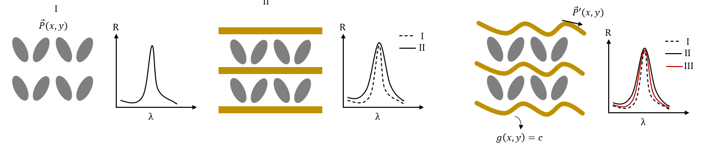

This semester project explores a field-based approach to electrode optimization in photonic and electromagnetic resonators. Starting from CST simulations of a baseline structure, I extract the field distributions at resonance and identify surfaces tangent to the local power flow. Aligning the electrodes with these surfaces minimizes field disturbance and energy loss, which translates into a measurable improvement in the resonator's quality factor. The work builds on the idea of power-flow-conformal metamaterials and combines electromagnetic theory with numerical inverse design.

<figure>
  
  <figcaption>Successive alignment of electrodes with field-based surfaces and the resulting resonance behavior.</figcaption>
</figure>
