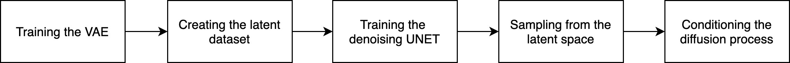
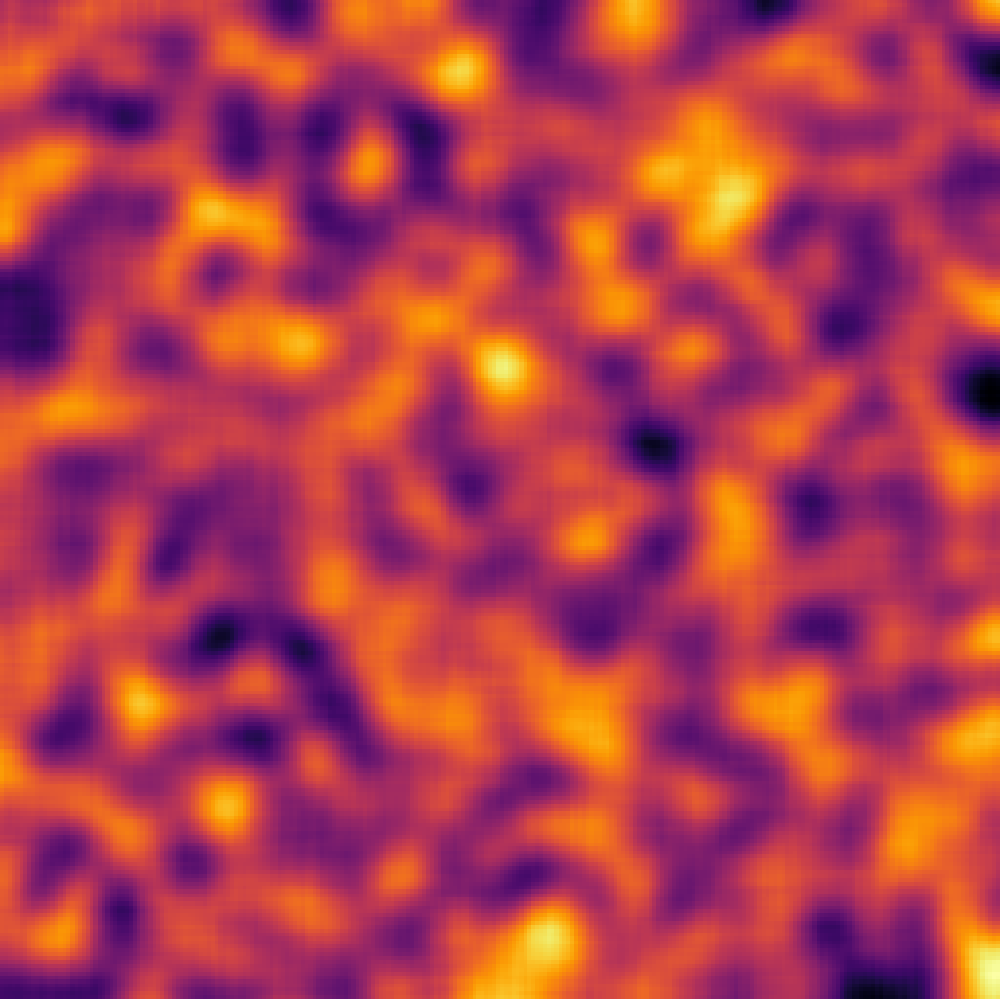
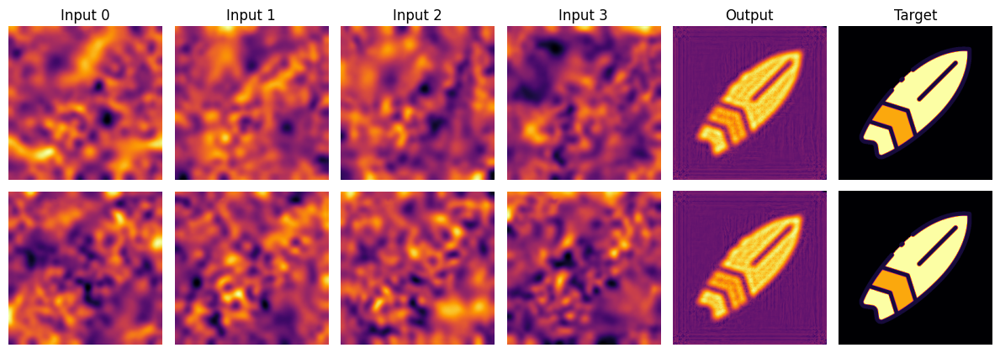

This project aimed to develop a new generation of optical computing tools using Spatial Light Modulators (SLMs) and AI-based generative models.  
The goal was to create a complete pipeline capable of transforming a desired optical function into physical SLM masks and predicting the resulting light pattern — a direct combination of optics, deep learning, and inverse design.

By combining Variational Auto-Encoders (VAEs) and Latent Diffusion Models (LDMs), the system learns to design optical masks directly from data, bypassing slow physics simulations.  
This enables the generation of diverse, hardware-aware masks that perform specific optical functions efficiently, demonstrating how machine learning can accelerate energy-efficient, high-speed optical information processing — paving the way for AI-driven optical design.

  

Two optical setups were explored during the project.  
The first, a compact “zigzag” configuration, uses a gold-coated glass slab to reflect light multiple times within a small space, paving the way for integrated optical computing.  
The second setup, shown below, is a robust multi-plane SLM configuration that offers greater flexibility and precision for data acquisition and model training.

  

On the software side, a full AI pipeline was implemented:

<ul>
  <li>A custom dual-decoder VAE encoding both SLM inputs and optical outputs.</li>
  <li>A diffusion model operating in the latent space to generate new, valid SLM patterns.</li>
  <li>Conditioning strategies to guide mask generation — from hard target matching to future text-to-physics conditioning.</li>
</ul>

  

The final proof of concept demonstrated that neural networks can design optical masks that recreate a desired light pattern, marking an early step toward real-time, AI-assisted optical design.  
Below is an example of a generated optical output obtained from the trained pipeline.

  

