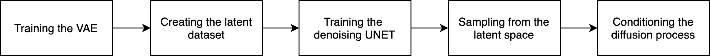
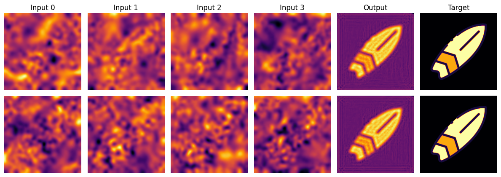

Conducted full-time at EPFL's Laboratory of Applied Photonic Devices (LAPD), this project develops an AI-driven pipeline for optical computing on Spatial Light Modulators (SLMs). A dual-decoder Variational Auto-Encoder jointly embeds SLM inputs and their optical outputs, and a latent diffusion model learns to generate new valid masks directly from data, bypassing slow physics simulations. Two optical setups were explored — a compact zigzag configuration on a gold-coated slab and a multi-plane SLM bench used for data acquisition — together with conditioning strategies that drive the generator toward user-specified optical functions. The final proof of concept demonstrates that a neural network can design SLM masks whose predicted light patterns match the target, an early step toward real-time AI-assisted optical design.

<figure>
  
  <figcaption>End-to-end pipeline: VAE, latent diffusion model, and conditioning strategy.</figcaption>
</figure>

<figure>
  
  <figcaption>Optical output generated by the trained pipeline from an SLM mask.</figcaption>
</figure>
