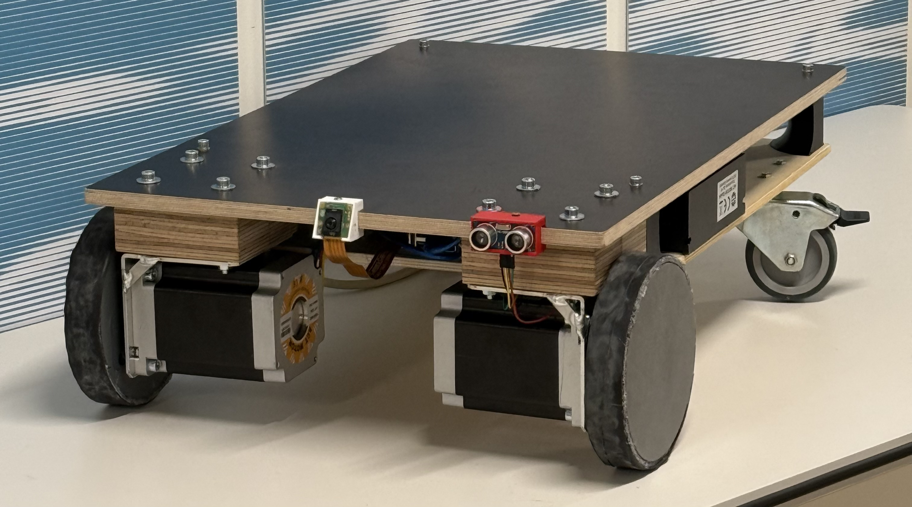

Carrie is an autonomous robot developed in the course "Products Design and Systems Engineering", with the purpose of carrying the user's belongings.
It's able to track and follow its owner, differentiating it from the other persons in the robot's field of view.

COMPLETE