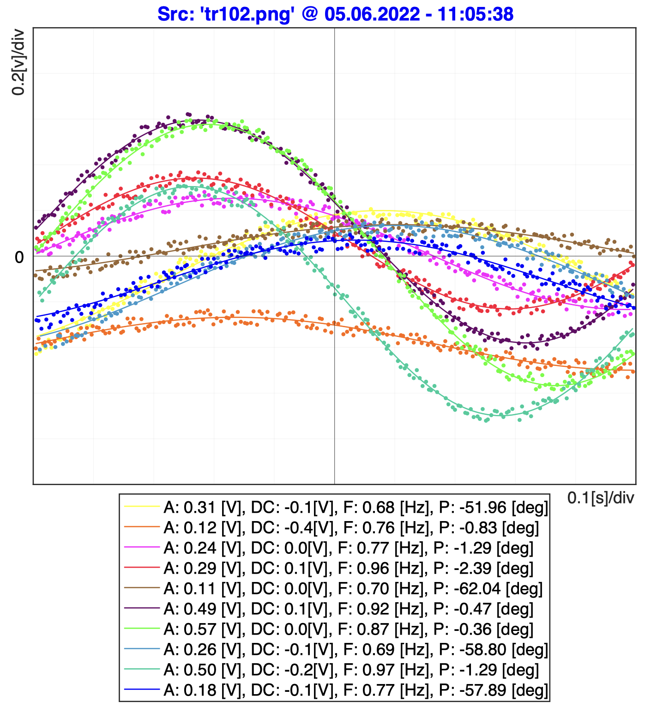

This project aimed to develop a complete data extraction and visualization toolchain linking three environments — C, LabVIEW, and MATLAB — to convert oscilloscope screenshots into numerical data and fitted sinusoidal models. The process begins with a C program that analyzes image pixels, identifies color-coded traces, and exports their coordinates. LabVIEW acts as the central orchestrator, managing user interaction, file exchanges, and automated calls to the other programs. Finally, MATLAB performs perspective correction, signal reconstruction, and sinusoidal fitting, generating a clean, annotated plot and PDF report summarizing all waveform parameters (amplitude, offset, frequency, phase).

  
  Oscillo2Data LabVIEW interface.

The final interface allows users to load any oscilloscope image, visualize the extracted curves, and automatically produce a formatted PDF output showing the fitted signals and their numerical parameters, as illustrated below.

  
  Fitted oscilloscope traces.

