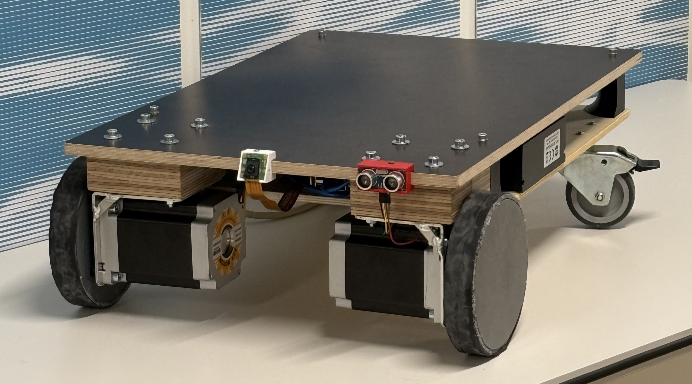
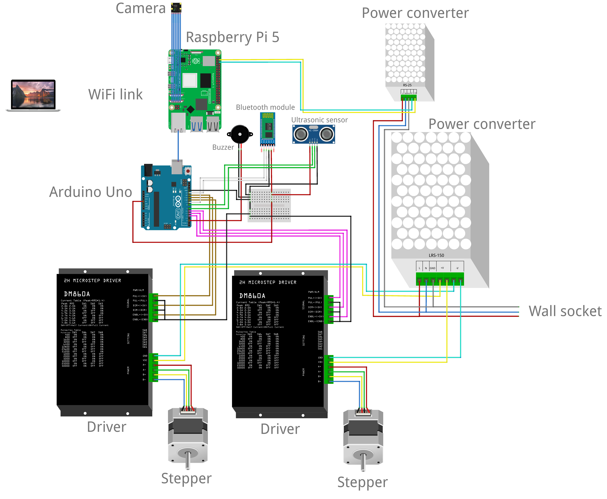
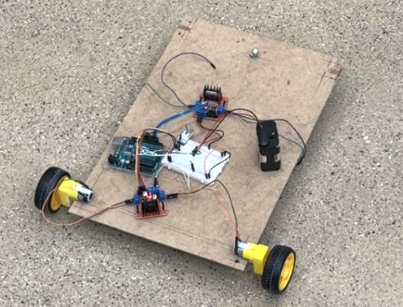
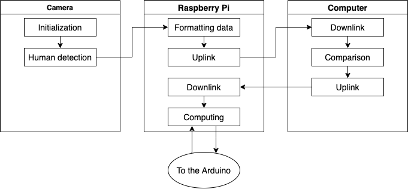

As part of the Product Design and Systems Engineering in a Team course at EPFL, I contributed to the development of CarriE, an autonomous robot designed to help users carry heavy loads in public indoor spaces such as airports, shopping malls, and train stations. 
The system combines computer vision for person re-identification, ultrasonic sensors for obstacle detection, and a mobile interface enabling both autonomous and manual control. 
My main role focused on implementing the camera-based tracking system, developing the web interface between the Raspberry Pi, Arduino and computer, and creating the mobile app used to control the robot. 
The prototype successfully demonstrated reliable user tracking and smooth navigation, validating the concept for large-scale deployment within a rental-based mobility service.

  

The robot was built as a compact mobile platform capable of transporting up to 50 kilograms while maintaining stability in dynamic environments. 
It uses two stepper-driven wheels for differential motion and two passive caster wheels for balance. 
The onboard system integrates a Raspberry Pi 5, an Arduino Uno, and several sensors that handle perception, communication, and control tasks.

  

The electrical and mechanical integration was realized by connecting the Raspberry Pi, responsible for image processing and data handling, with the Arduino that manages motor control and sensor feedback. 
The early prototype shown below was used to pitch the project, test the code, and validate the overall design.

  

The CarriE robot’s autonomous following ability relies on a person re-identification system that connects a Raspberry Pi 5, a Raspberry Pi AI Camera, and an external computer. 
The camera detects humans using a MobileNet model, and the Raspberry Pi sends extracted features to a computer through a web-based communication link built with Flask. 
The computer compares these features to a reference profile using an OSNet embedding model and returns the identification result. 
The Raspberry Pi interprets this information and sends commands to the Arduino to control the robot’s movement, enabling real-time following with distributed computation.

  

This distributed architecture allows efficient data flow and responsive control while compensating for the limited computational capacity of the Raspberry Pi. 
By combining computer vision, embedded programming, and hardware integration, the system demonstrated robust person tracking and smooth mobility in indoor environments.

