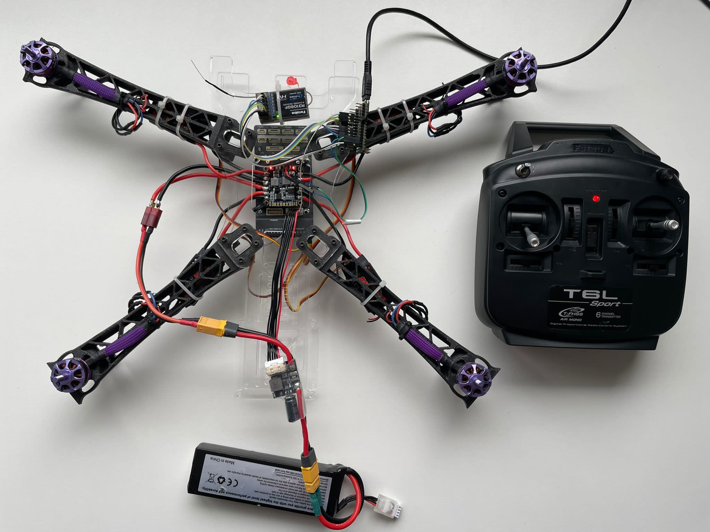
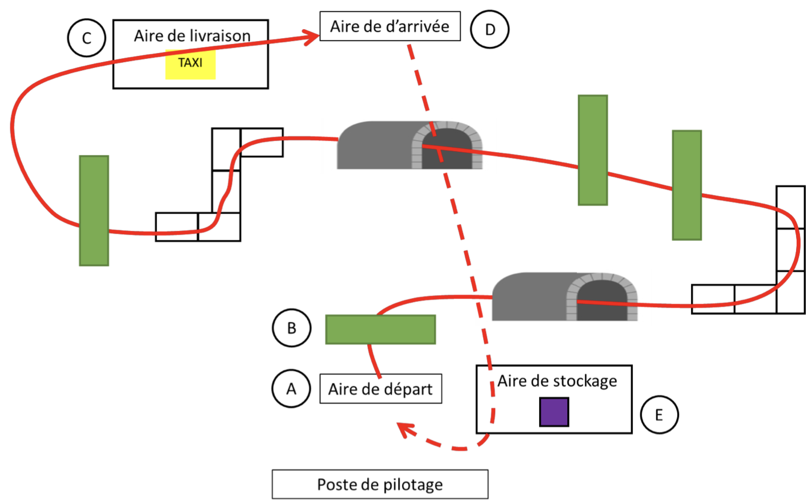
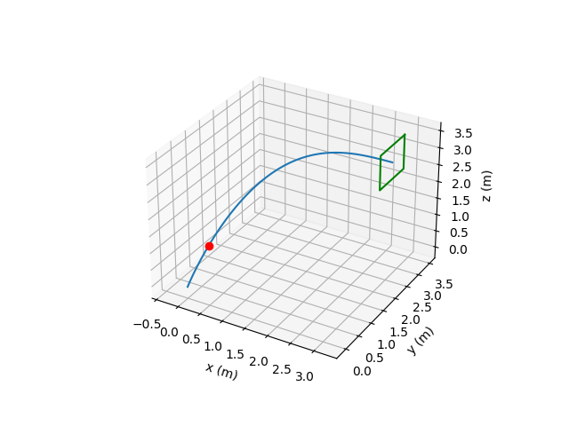

As part of the Intelligent Vehicles project at CentraleSupélec, I worked on the development of DroneLoad, an autonomous quadcopter designed to participate in the national DroneLoad competition organized by Planète Science and Safran. 
The challenge simulates real-world delivery missions for the 2024 Paris Olympics, where drones must autonomously detect, retrieve, and deliver colored objects while navigating through tunnels and windows. 
The goal was to design and program a system capable of performing these tasks both manually and autonomously.

  

The project was divided into several work areas: mechanical design, embedded electronics, flight control, and computer vision. 
We built a custom frame from 3D-printed parts and plexiglass plates to integrate all required components, including a Jetson Nano for onboard computation, a PixHawk 6X flight controller, a RealSense depth camera, and various sensors such as lidar and ultrasonic modules. 
This configuration provided a modular and robust platform for testing autonomous flight capabilities.

  

On the software side, I contributed to the perception and simulation modules. 
The drone’s onboard computer processes visual data from the RealSense camera to detect objects using color segmentation and a convolutional neural network trained to recognize competition items. 
Trajectory generation and control were implemented in Python with the MAVSDK library, enabling communication between the Jetson, the PixHawk controller, and the Gazebo simulation environment. 
A polynomial-based path planning algorithm was developed to compute smooth trajectories through 3D obstacles such as windows.

  

The system was tested both in simulation and on the physical prototype. 
Despite hardware challenges and component failures, the team successfully demonstrated controlled flight, reliable object detection, and preliminary autonomous behaviors in the lab environment. 
The project served as a proof of concept for future iterations aimed at achieving full autonomy in the next competition.

