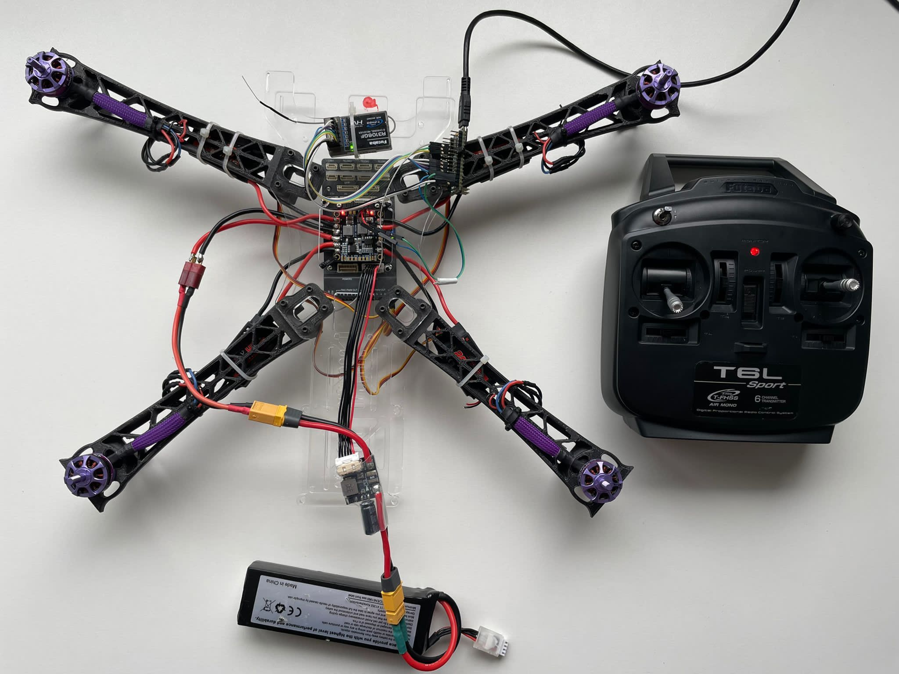
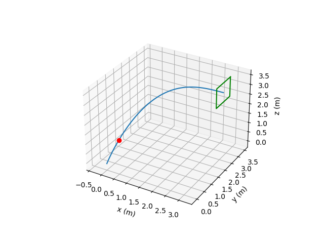

DroneLoad is an autonomous quadcopter developed at CentraleSupélec for the national Planète Science / Safran competition, which simulates Paris 2024 delivery missions through tunnels and windows. I contributed to the mechanical integration — a custom 3D-printed frame carrying a Jetson Nano, a PixHawk 6X, a RealSense depth camera, and lidar/ultrasonic sensors — and to the perception and simulation software. The onboard computer runs color segmentation and a convolutional network trained on competition objects, while Python and MAVSDK handle communication with the flight controller and the Gazebo simulator. A polynomial path-planning algorithm generates smooth 3D trajectories through windows. Hardware failures limited full in-flight validation, but reliable object detection and preliminary autonomous behaviors were demonstrated in the lab.

<figure>
  
  <figcaption>DroneLoad quadcopter and control setup.</figcaption>
</figure>

<figure>
  
  <figcaption>Simulated trajectory for window traversal in 3D space.</figcaption>
</figure>
